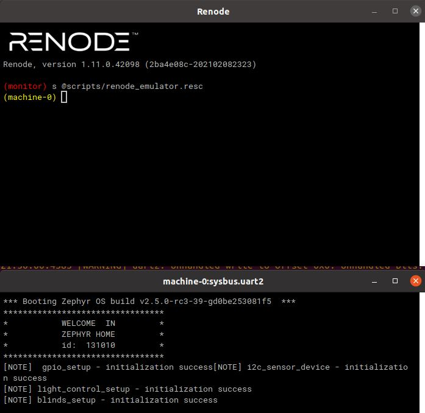
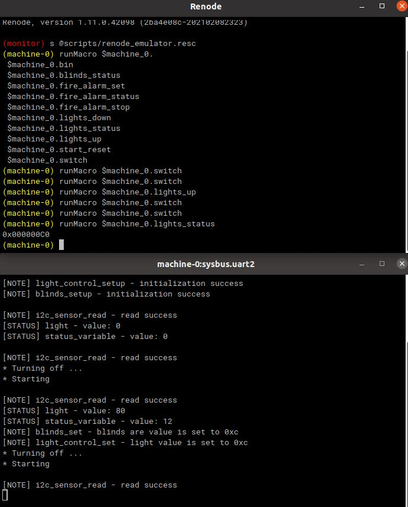
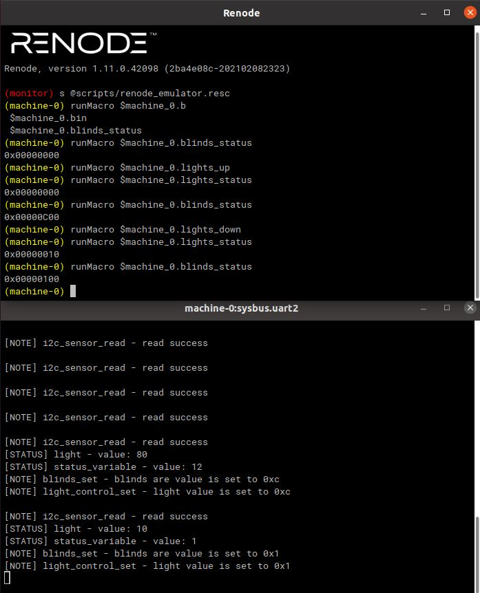
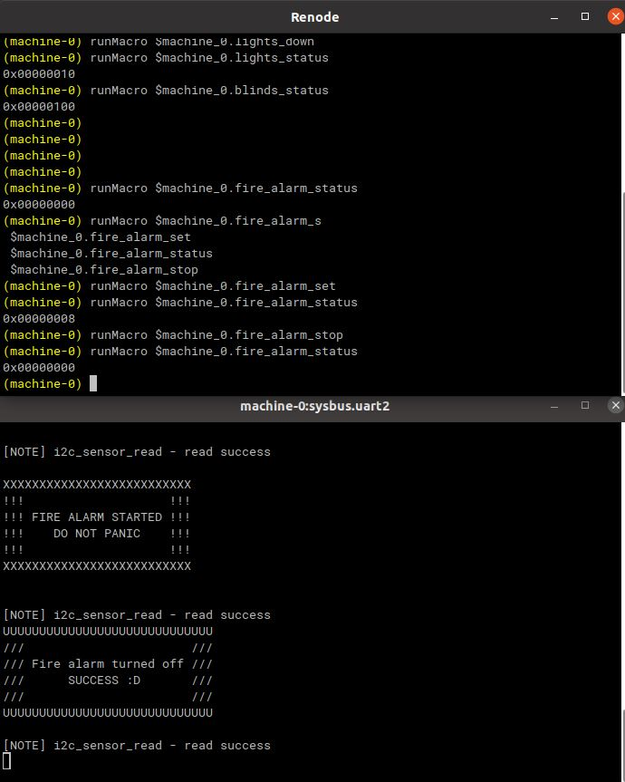

Pokaz wynikow
=========

Program daje feedback uzytkownikowi poprzez UART. Przesylane sa inforamcje o inicjalizacji portow, urzadzen, a takze wartosci odczytanych z sensorow.

Program mozna wlaczyc i wylaczych przy pomocy makra 'switch'. Zachowywane sa wartosci/statusy zaslon i oswietlenia.

Zmiana oswietlenia wywoluje wplyw na zaslony(blinds_set) i oswietlenie wewnetrzne (light_control_set).

Program reaguje na przerwanie w formie alarmu pozarowego.

  
  
Projekt dostepny jest pod adresem `github.com/sf96/zephyrhome`

